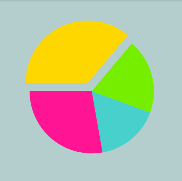
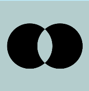
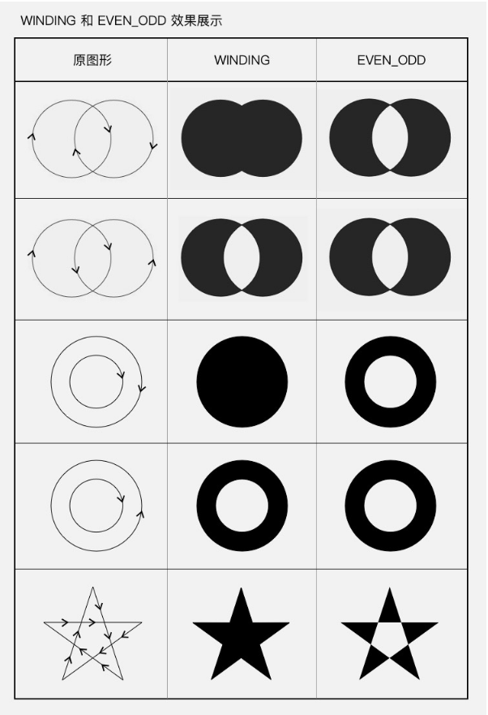
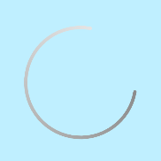
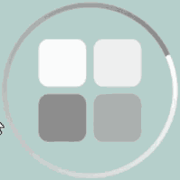
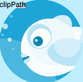
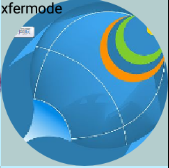
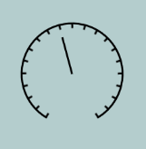

# 技术分享 -- 自定义绘制(结合着Hencoder的自定义绘制的文章以及github的项目讲解)
[github项目地址](https://github.com/chengxiaobo3/TestCanvas)  
[参考资料-hencoder 1-1,1-2](https://hencoder.com/ui-1-1/)  
[参考资料-hencoder二期报班](https://ke.qq.com/course/326937)
## 1. 坐标系（见下图）
 

## 2. Canvas
* canvas.drawXXX()系列
   * canvas.drawArc()  
      * startAngle：起始的角度，sweepAngle：扫过的角度,userCenter=true|false的情况见下面的图
        ```java
        public void drawArc(@NonNull RectF oval, float startAngle, float sweepAngle, boolean useCenter,
            @NonNull Paint paint) {
        super.drawArc(oval, startAngle, sweepAngle, useCenter, paint);
        }
        ```
        

     * 饼图的例子-上课的例子(见github项目 PieChatView.kt)  
       
   * canvas.drawPath()  
      * drawPath例子-上课的例子(见github项目 DrawPath.kt)   
       </br>
      * path.FillType     
         
    
   * canvas.drawbitmap() (见github项目 DrawBitmap.kt)  
     刚进影视库组时，遇到演员item头像变形（见demo）。  
      

   * canvas.drawText() (第二期讲)
 
* Canvas 的辅助类方法：范围裁切和几何变换（下期讲）
## 3. Paint
 * 常用的方法
   * Paint.setStyle(Style style) 设置线条的模式（空心，实心）
   * Paint.setStrokeWidth(float width) 设置线条宽度
   * Paint.setColor(int color) 设置颜色
   * Paint.setTextSize(float textSize) 设置文字大小
   * Paint.setAntiAlias(boolean aa) 设置抗锯齿开关
* 设置颜色(见扔物线的文档 1-2节)
  *  设置shader 辐射渐变Demo(见github项目 PaintSweepGradient.kt)   
      ```java
      当设置了 Shader 之后，Paint 在绘制图形和文字时就不使用 setColor/ARGB() 设置的颜色了，而是使用 Shader 的方案中的颜色。
      ```
     <br>   
     谈一谈我对shader的理解:我理解的是有一块带坐标系的地板，通过不同的shader（LinearGradient,SweepGradient,bitmapGradient等）把这块地板涂上了颜色，等到canvas去drawXXX()的时候，就从这块地板对应的位置取对应的颜色就行了。  
   *  工作中canvas画动画的例子(见github项目 IndicatorView.kt和VerticalShapeLoading.kt)   
          
     谈一谈这两个动画的思路： 
  *  画圆形图像的例子-xfermode为上课的例子 (见github项目 CircleBitmapClipPath.kt、CircleBitmapShader.kt和CircleBitmapXfermode.kt)    
          

     1.clipPath 有点类似于我们小时候玩的游戏，底下一张白纸，上面是一张圆窟窿的纸，我们用铅笔在上面画画，就能画出一个圆来。
     我们在用clipPath的时候,注意绘制的顺序，要canvas.clipPath(),再canvas.drawXXX();  
     2.用BitmapShader去画圆的时候，首先想象bitmap把地板图上了颜色。之后画圆，在地板上对应的位置取对应的颜色，画圆。用bitmap给地板上色，就像贴瓷砖一样，第一块很好贴，那么第二块，第三块呢？shader可以指定贴瓷砖的模式，Shader.TileMode.CLAMP、REPEAT、MIRROR等。  
     3.Xfermode模式-混合模式，先画目标图像，设置混合模式，再画源图像，注意使用离屏缓冲。深入理解一下，先开辟了一个新的画布，画一个目标图像，再用源图像去跟目标图像去混合，重叠的部分应该是什么颜色，没有重叠部分应该是什么颜色。混合好图像以后，再画到画布上。
     ```java
     对比这三种画圆形图像的情况：
     1.通过请教同事晨星，得知glide库做圆形图像就是用的 xfermode实现的
     2.通过clipPath实现的圆型图片，有锯齿
     3.bitmapShader实现的圆形图片，对bitmap的形状必须是正方形的，如图所示，图片是长方形的，所以底部的图有问题。（并不是不可以实现，可以根据原来的bitmap生成一个方形的bitmap）
     至于为什么用xfermode（混合模式），而非bitmapshader去实现，就是一个疑问了？？？
     ```
* 设置效果
    * pathEffect-上课的例子(见github项目 DashBoard.kt)  
         
      * 1.画圆弧。  
      * 2.用矩形的path画虚线。
         *  一、计算path的长度PathMeasure
         *  二、计算每个矩形path之间的距离。 
         *  三、用矩形path画虚线 
      * 3.画指针。
## 4.drawText(第二期)
  * 课上例子-对齐的demo
  * 课上例子-breakText的demo
  * 测量文字的宽度的应用(工作中遇到)

## 5. canvas的裁切和canvas的几何变换（第二期）
## 6. 绘制顺序（第二期）
