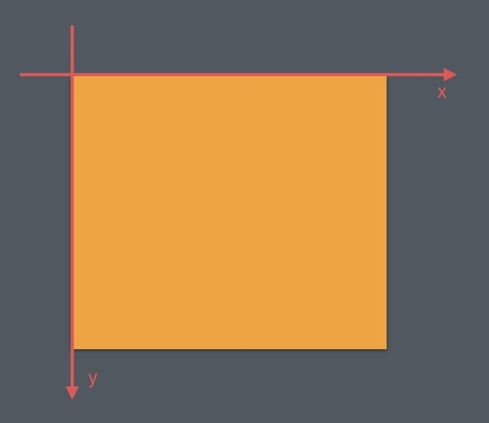

## 1. 坐标系（见下图）
 

## 2. Canvas
* canvas.drawXXX()系列
   * canvas.drawArc()  
      * startAngle：其实的角度，sweepAngle：扫过的角度,userCenter=true|false的情况见下面的图
        ```java
        public void drawArc(@NonNull RectF oval, float startAngle, float sweepAngle, boolean useCenter,
            @NonNull Paint paint) {
        super.drawArc(oval, startAngle, sweepAngle, useCenter, paint);
        }
        ```
        
   * canvas.drawPath()
   * canvas.drawText()
* Canvas 的辅助类方法：范围裁切和几何变换（下期讲）
## 3. Paint
 * 常用的方法
   * Paint.setStyle(Style style) 设置线条的模式（空心，实心）
   * Paint.setColor(int color) 设置颜色
   * Paint.setStrokeWidth(float width) 设置线条宽度
   * Paint.setTextSize(float textSize) 设置文字大小
   * Paint.setAntiAlias(boolean aa) 设置抗锯齿开关
* 设置颜色
* 设置效果
* 对文字绘制的辅助

## 4. 绘制顺序
## 下期见（canvas的裁切和canvas的几何变换）