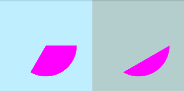
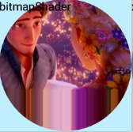
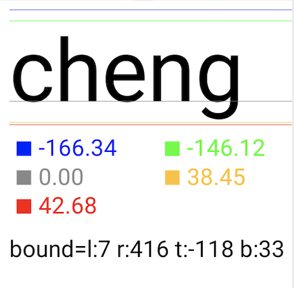
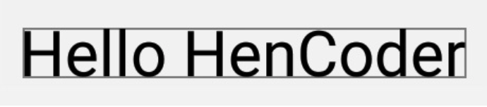

# 技术分享 -- 自定义绘制API
[github项目地址](https://github.com/chengxiaobo3/TestCanvas)  
[参考资料-hencoder 1-1,1-2](https://hencoder.com/ui-1-1/)  
[参考资料-hencoder二期报班](https://ke.qq.com/course/326937)
## 1. 坐标系（见下图）
<br>
关于坐标系彻底搞明白几个概念 ：
* x,y
* rawX,rawY（MotionEvent event 可以获取）
* translationX, translationY
* ScrollX,ScrollY
* left,top
* 思考：
  * 1.其中 ？+？=？
  * 2.x和y是相对谁的值？
  * 3.如何判断一个点是否在屏幕上？

## 2. Canvas
* canvas.drawXXX()系列
   * canvas.drawArc()  
      * startAngle：起始的角度，sweepAngle：扫过的角度,userCenter=true|false的情况见下面的图
        ```java
        public void drawArc(@NonNull RectF oval, float startAngle, float sweepAngle, boolean useCenter,
            @NonNull Paint paint) {
        super.drawArc(oval, startAngle, sweepAngle, useCenter, paint);
        }
        ```
        

     * 饼图的例子-上课的例子(见github项目 PieChatView.kt)  
         
       思路：
       * 1.给出四个角度（相加等于360），四个不同的颜色。  
       * 2.画四个扇形得到如下结果   
         <br>
       * 3.第n个偏移(n<4)怎么画呢？画第n个扇形的时候，让坐标系沿着角平分线偏移一下画扇形，画完以后再回到把坐标系移回来，那么问题来了，如何计算坐标系偏移的x和y 呢？     
       

   * canvas.drawPath()  
      * drawPath例子-上课的例子(见github项目 DrawPath.kt)   
       <br>
      * path.FillType(path相交重合的部分用实心还是空心填充)
         
    
   * canvas.drawbitmap() (见github项目 DrawBitmap.kt)  
     刚进影视库组时，遇到演员item头像变形（见demo）。  
    

    ``` java
      public void drawBitmap(@NonNull Bitmap bitmap, @Nullable Rect src, @NonNull Rect dst,
            @Nullable Paint paint) {
        super.drawBitmap(bitmap, src, dst, paint);
    }
    变形的原因是没有指定 bitmap源对应矩形 。

    ```

   * canvas.drawText() (第二期讲)
 
* Canvas 的辅助类方法：范围裁切和几何变换（下期讲）
## 3. Paint
 * 常用的方法
   * Paint.setStyle(Style style) 设置线条的模式（空心，实心）
   * Paint.setStrokeWidth(float width) 设置线条宽度
   * Paint.setColor(int color) 设置颜色
   * Paint.setTextSize(float textSize) 设置文字大小
   * Paint.setAntiAlias(boolean aa) 设置抗锯齿开关
* 设置颜色(见扔物线的文档 1-2节)
  *  设置shader 辐射渐变Demo(见github项目 PaintSweepGradient.kt)   
      ```java
      当设置了 Shader 之后，Paint 在绘制图形和文字时就不使用 setColor/ARGB() 设置的颜色了，而是使用 Shader 的方案中的颜色。
      ```
     <br>
     谈一谈我对shader的理解:我理解的是有一块带坐标系的地板，通过不同的shader（LinearGradient,SweepGradient,bitmapGradient等）把这块地板涂上了颜色，等到canvas去drawXXX()的时候，就从这块地板对应的位置取对应的颜色就行了。
   *  工作中canvas画动画的例子(见github项目 IndicatorView.kt和VerticalShapeLoading.kt)   
         <br>
     第一个动画的思路是：
      * 1.一个圆形/半圆一直在转动的动画。
      * 2.四个圆角矩形的透明度一直在由灰->白 变化。
        * 难点是：
         1.一开始的想法是，用一个valueAnimator 0->1->0 但是，每个圆角矩形的初始值都不为0，如果为0的话，就会变成四个圆角矩形都从灰色变成白色了，所以valueAnimator不能解决我们的问题。发现数学里面的 sina,cos 函数可以解决我们的问题。<br>
      * 3.计算四个圆角矩形的宽度和位置。

      第二个动画的思路是：
       * 1.计算四个圆角矩形的宽度和位置。
       * 2.计算四个圆角矩形的高度。
         * 四个圆角矩形都有一个基础值，初始百分比，和最高值。和第一个动画一样，不能用valueAnimator实现，用sina的绝对值实现的。
         * 振幅 = 最高值-基础值
         * 矩形的高度= 基础值+振幅* （percent (一个周期的百分比)+初始值的百分比）
      * 3.用timer实现计时器time%1000/1000。1秒钟就对应一次 0-1的周期。
          如果想要2秒钟对应一个周期的话，则time%1000/1000/2即可。
          

  *  画圆形图像的例子-xfermode为上课的例子 (见github项目 CircleBitmapClipPath.kt、CircleBitmapShader.kt和CircleBitmapXfermode.kt)    
          

     1.clipPath 有点类似于我们小时候玩的游戏，底下一张白纸，上面是一张圆窟窿的纸，我们用铅笔在上面画画，就能画出一个圆来。
     我们在用clipPath的时候,注意绘制的顺序，要canvas.clipPath(),再canvas.drawXXX();
     2.用BitmapShader去画圆的时候，首先想象bitmap把地板图上了颜色。之后画圆，在地板上对应的位置取对应的颜色，画圆。用bitmap给地板上色，就像贴瓷砖一样，第一块很好贴，那么第二块，第三块呢？shader可以指定贴瓷砖的模式，Shader.TileMode.CLAMP、REPEAT、MIRROR等。
     3.Xfermode模式-混合模式，先画目标图像，设置混合模式，再画源图像，注意使用离屏缓冲。深入理解一下，先开辟了一个新的画布，画一个目标图像，再用源图像去跟目标图像去混合，重叠的部分应该是什么颜色，没有重叠部分应该是什么颜色。混合好图像以后，再画到画布上。
     ```java
     对比这三种画圆形图像的情况：
     1.通过请教同事晨星，得知glide库做圆形图像就是用的 xfermode实现的
     2.通过clipPath实现的圆型图片，有锯齿
     3.bitmapShader实现的圆形图片，对bitmap的形状必须是正方形的，如图所示，图片是长方形的，所以底部的图有问题。（并不是不可以实现，可以根据原来的bitmap生成一个方形的bitmap）
     至于为什么用xfermode（混合模式），而非bitmapshader去实现，就是一个疑问了？？？
     ```
* 设置效果
    * pathEffect-上课的例子(见github项目 DashBoard.kt)  
      
      * 1.画圆弧。
      * 2.用矩形的path画虚线。
         *  一、计算path的长度PathMeasure
         *  二、计算每个矩形path之间的距离。
         *  三、用矩形path画虚线
      * 3.画指针。
## 4.drawText
  * 第一个例子下图 -上课例子 (见github项目 DrawTextCenter.kt) <br>
   <br>
  左边的图为 canvas.drawText画出来的（也是要讲的例子），右面的图是TextView, android:gravity=center。    
  要实现左图的效果，大家认为是不是应该很简单呀，这有什么难的，事实上不是这样的。  
  首先drawText的代码如下  
    ```java
    //x: The x-coordinate of the origin of the text being drawn 文字的原点为x
    //y: The y-coordinate of the baseline of the text being drawn 文字的baseline为y
    canvas.drawText("cheng", x, y, paint)
    ```
     <br>
    <font size=3 color=#ff0000>* 注意drawText的位置，并不是左上角的位置 </font>  
    另外，paint还提供了Paint.Align.CENTER
    ```java
    paint.textAlign = Paint.Align.CENTER //文字最中间的地方在X处
    ```
     <br>
    回到我们的要做的效果，我们要指定 drawText的 x,y 为中心点，并且textAlign=center 见如下代码和如下效果
    ```java
    paint.textAlign = Paint.Align.CENTER //文字最中间的地方在X处
    canvas.drawText(s, width/2.0f, height/2.0f, paint)
    ```
     <br>
    <font size=3 color=#ff0000>？？？ </font> 文字有点靠上。原因是因为y的值为baseline，见下图，灰色的线即为baseline。  
     <br>
    1.我们可以通过 paint.fontMetrics 获取 top、ascent、baseline、descent、bottom的值
     <br>
    2.我们也可以通过 paint.fontSpacing获取行距  
      <br>
    3.我们也可以通过 getTextBounds(String text, int start, int end, Rect bounds) 获取文字的显示范围，注意：文字的范围会根据文字的内容变化(值参考图1)  
      <br>
     这么多值，可以利用，看看如何计算，才能让文字在View中是居中的呢？？？
    
     <br>
    ```java
    baselineY=height/2-(paint.fontMetrics.ascent + paint.fontMetrics.descent) / 2.0f
    ```
  * 第二个例子见下图-StaticLayout实现换行(见github项目 TestStaticLayout.kt) 
   <br>
    ```java
    canvas.drawText 是不能换行的，我们用staticLayout实现换行。 
    1.staticLayout 指定宽度，超过宽度自动换行。
    2.staticLayout 通过换行符 \n
    ```

 * 第三个例子见下图-BreakText实现图文混合-上课的例子(见github项目 TestBreakText.kt) 
   <br>
   ```java
   var count1 = paint.breakText(s, count, s.length, true, textWidth, floatArray)
   canvas.drawText(s, count, count + count1, 0.0f, -paint.fontMetrics.top + lineSpacing * (line - 1), paint)
   ```
   指定字符串截取的范围从第几个到第几个，View的宽度，返回截取的字符的个数。
  * 测量文字的宽度的应用-item库，更新到第几集<br>   
   <br>
    ```java
    float measureWidth(String text, Float textSize) {
        Paint paint = new Paint();
        paint.setTextSize(textSize);
        return paint.measureText(text);
     }
    ```

## 5. canvas的裁切和canvas的几何变换
  * 第一个demo见下图-上课的例子camera实现3d动画  
    <br>
   分析一下，这是一个什么样的效果呢。图片始终有一部分是没有做三维旋转的，有一部分做三维旋转，折痕线逆时针旋转了270度。  
    <br>
   好像还是不明白怎么实现的，先弄一个简单的喽

   位移+clicp

## 6. 绘制顺序
